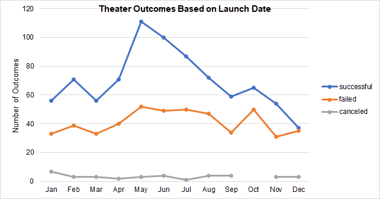
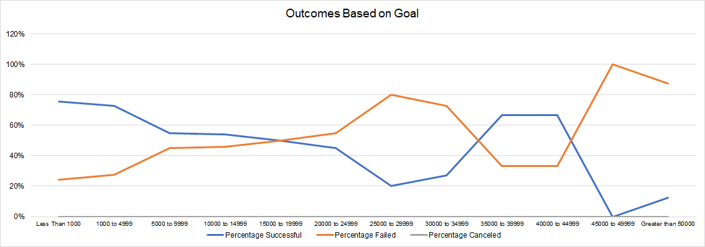
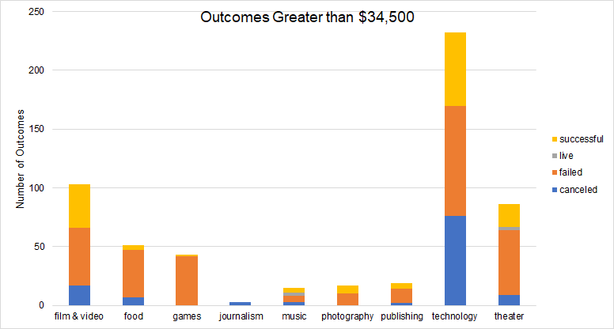
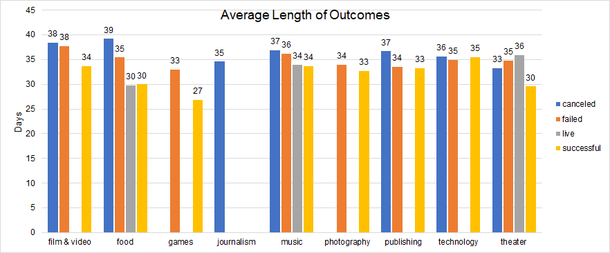

# Kickstarting with Excel

## Overview of Project

### Purpose
The purpose of this analysis is to show Louise how her fundraiser for the play *Fever* performed in comparison to other campaigns based on their launch date and their funding goals.
## Analysis and Challenges

### Analysis of Outcomes Based on Launch Date

To perform this analysis, I have created a pivot table with the kickstarter data of launch date and outcomes and filtered the table to only reflect data from the theater category. For ease of analysis of the table, I have created a line chart that shows the theater outcomes of successful, failed and canceled based on their month of launch.

According to the graph above, the peak season of successful outcomes for theater campaigns is between April to June whereas the trough can be found in November and December. The graph also shows that the number of successful campaigns differ greatly over the year depending on the season, whereas the number of failed campaigns appears to be consistent throughout the months with a slight period of volatility from September to November. Moreover, the overall number of successful outcomes for theater campaigns seem to be greater than the number of failed outcomes. As shown above, the campaigns conducted during the peak season of April-June were more likely to be successful in meeting their funding goals, as Louise's play *Fever* did.

However, another factor that needs to be taken into consideration but is not illustrated is the amount of the funding goals which will be explained in the next section.

### Analysis of Outcomes Based on Goals
For this analysis, I had to use formulas to classify the funding goals into different buckets and count the number of each outcome across all parent categories. After classifying the funding goals to each bucket and counting the number of outcomes, I used the percentage of each outcome based on the total number of projects in each respective bucket to create the line chart below.

As shown in the graph, *Fever*'s funding goal of +$10,000 is located in a range that has about 8% more likelihood to have sucessful outcomes than failed. If Louise had raised her funding goal by $5,000 or more, the funding might have experienced more difficulties in reaching its goal. The campaigns that had a funding goal of $5,000 or lower seemed to surpassed the percentage of failed outcomes by ~50%. Another section that shows a higher percentage of successful outcomes than failed outcomes is the range of $35,000-$44,999 which might be due to average funding amount for some specific sectors that could be seen as outliers.  

### Challenges and Difficulties Encountered
The first challenge I encountered was cleaning the data and making it more readable. At first glance, there were some columns that were not in a readable format, for instance, the deadline and launched_at columns contained a series of numbers that did not seem to be dates or times. Another issue is that some columns were not structured in a way that is user-friendly. For example, the "Category and Subcategory" column has information that included both category and subcategory data within each cell which made it difficult to analyze by the parent category and subcategory separately. To overcome the first difficulty of reading the data in the deadline and launched_at columns, I have created two new columns and used these columns to convert the timestamp data into dates. In regards with the second challenge of the category and subcategory being placed in the same column, I separated the subcategory from the parent category by using the text to columns formula.  

Another challenge encountered in this analysis is that 13.8% of the data provided are outliers so it is difficult to determine whether they are good comparisons to *Fever* without additional information on these data points. To overcome this challenge of determining whether the outliers could be a potential comparison to *Fever* with the only data available, I have narrowed down the outcomes based on goals to greater than $34,500 which is the highest data point of 1.5 x IQR of the upper quartile. As shown in the graphic below, the technology sector has successful outcomes significantly higher than the successful outcomes in other sectors. Therefore, it can be concluded that a large portion of the succesful outcomes contained within the outliers were raised from technology related crowdfundings.    

## Results

- What are two conclusions you can draw about the Outcomes based on Launch Date -In the theater category, the month that launched the most successful Kickstarter campaigns was May and there were more successful outcomes overall than failed outcomes.  
- What can you conclude about the Outcomes based on Goals?
-Kickstarter campaigns are more likely to succeed if they have a funding goal of less than $15,000 or in between $35,000 to$44,999 depending on the campaign's category.
- What are some limitations of this dataset?
-The initial dataset is not readable and requires some cleaning and formatting. There are many outliers in the dataset and more information about these datapoints are needed to understand better the different campaigns. 

- What are some other possible tables and/or graphs that we could create?
-As shown below, one possible graph that can be created is a bar graph reflecting the average duration of a campaign across the different sectors. As the graph illustrates, the average length of a successful outcome is shorter than the other outcomes and the range of lenth of a campaign goes from 27 days to 39 days. Also, theater campaigns have an average length of 30 days for their successful campaigns. 

-Another possible graph that could provide Louise with helpful information is a graph showing the number of successful outcomes across the different categories over the years, as shown in the graph below. According to the graph, theater campaigns became popular to donors in mid-2013, peaked in 2015 and has experienced a sharp decline after 2016. Nevertheless, the number of successful outcomes for theater still remains higher than other campaign categories, which indicates a good opportunity for theater fundraisers.    
 